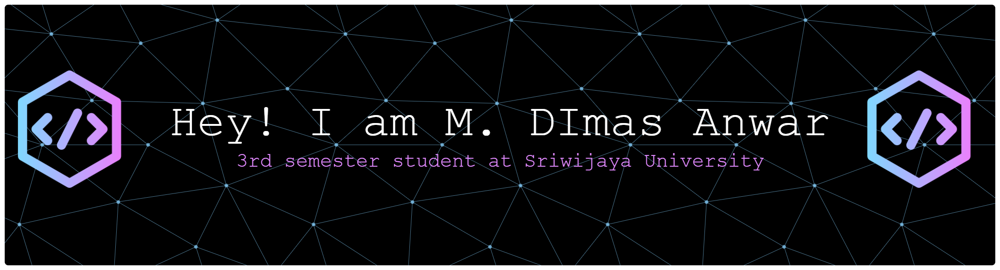
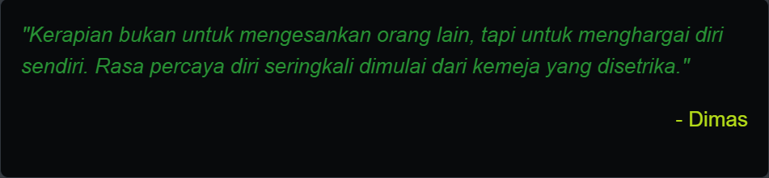

# 💫 About Me:
<h3 align="center">Saya adalah seorang mahasiswa semester 3 di Universitas Sriwijaya yang sedang aktif mempelajari pengembangan web dan teknologi informasi. Saat ini saya fokus memperdalam kemampuan di bidang web development dan sedang belajar berbagai framework modern. GitHub ini saya gunakan sebagai tempat dokumentasi perjalanan belajar, eksplorasi proyek pribadi, dan pengembangan portofolio. Saya percaya bahwa konsistensi belajar dan praktik langsung adalah kunci untuk menjadi developer yang handal. Silakan jelajahi repositori saya untuk melihat berbagai proyek sederhana yang saya bangun dalam proses belajar.</h3>

- 🔭 I’m currently working on [Website Undangan] (https://github.com/misterdhimaz/undangan) & [Website Ormada] (https://github.com/misterdhimaz/HIMATASTI)
- 👯 I’m looking to collaborate on [Resep Naks Kost](https://resep-naks-kost.vercel.app/)
- 🤝 I’m looking for help with friends
- 📫 How to reach me **dhimazanswer@gmail.com**
- 🌱 I’m currently learning Full Stack Developer
- ⚡ Fun fact Semangat saya nyala terus kalau udah ngoding malam-malam sambil denger musik lawas tahun 80/90 an...

## 🌐 Socials:
  

# 💻 Tech Stack:
          
# 📊 GitHub Stats:
 
 

### ✍️ My Quote

  

### 🔝 Top Contributed Repo

---

<h3 align="left">Main game yukss!</h3>
 
###

 

###
<!-- Proudly created with GPRM ( https://gprm.itsvg.in ) -->